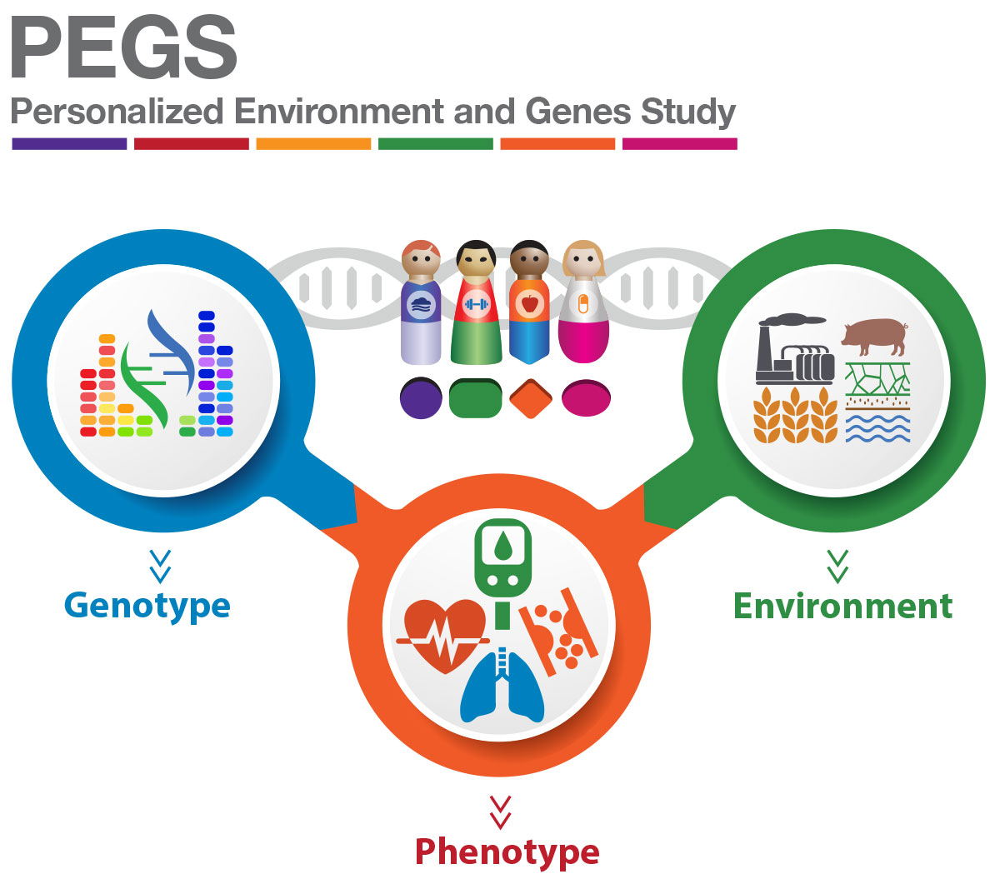

# Hypercholesterolemia DREAM Challenge Repository

This repository contains the code and documentation for the DREAM Challenge project aimed at predicting hypercholesterolemia, a significant risk factor for cardiovascular diseases. Utilizing a rich dataset from the Personalized Environment and Genes Study (PEGS), this project develops models to identify and analyze the multitude of factors affecting cholesterol levels.

## Challenge Overview

Hypercholesterolemia involves high levels of LDL cholesterol, which can lead to arterial plaque buildup and increased risks of heart attack and stroke. The DREAM Challenge seeks innovative approaches to predict and mitigate these risks through the analysis of health, genetic, lifestyle, and environmental data.

## Repository Structure

- `scripts/`: Contains Jupyter notebooks and Python scripts for data preprocessing and model development.
  - `Processing_Dream.ipynb`: Notebook detailing data integration, preprocessing, and model training.
  - `SNVs_plink_processing.py`: Script for processing SNV data.
- `assets/`: Includes resources such as SNP lists related to phenotype and clinical outcomes.
- `pictures/`: Folder for graphical resources, including the challenge overview diagram.

## Getting Started

1. Clone this repository.
2. Install all required dependencies.
3. Execute the preprocessing scripts in the `scripts/` folder to prepare the data.
4. Run the modeling scripts to train and evaluate the prediction models.

## Data Description

Data for this challenge is sourced from PEGS, encompassing:
- Health data
- Genomic data
- Environmental exposure data
- Geospatial data

Due to privacy concerns, data access is restricted. Please refer to [PEGS/NIEHS](LINK_TO_DATA_ACCESS) for more details.

## Dependencies

- Python 3.x
- Scikit-learn
- NumPy
- Pandas
- Imbalanced-learn
- Matplotlib

## License

This project is licensed under the MIT License - see [LICENSE.md](LICENSE_LINK) for details.

## Contact

For any queries related to this repository, please contact [CONTACT_INFORMATION].

## Acknowledgments

- DREAM Challenge organizers
- National Institute of Environmental Health Sciences (NIEHS)
- All contributors and participants
